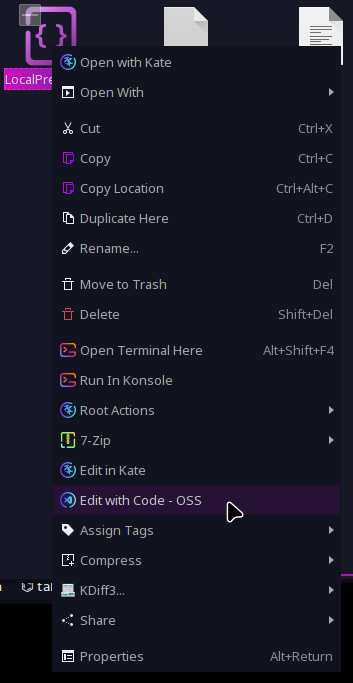
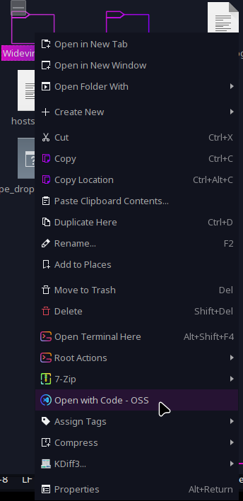

# [Edit/Open with Code - OSS](https://store.kde.org/p/2116391/)
Adding `Edit/Open with Code - OSS` to the menu (depending on whether it is a file or a folder). 

"Code - OSS" is a fully Open Source VSCode build (like Chromium is to the Google Chrome?) with less of telemetry.

 ᅚᅚᅚᅚᅚᅚᅚᅚ 
 
## Installation
Either download through Dolphin's Context Menu Settings 
*(Burger menu -> Configure -> Configure Dolphin -> Context Menu -> Download New Services -> `<Search for my listing>`)*  
or downloading **.desktop* files manually from the [KDE Store](https://store.kde.org/p/2116391/) or this github repo, and putting them in `~/.local/share/kservices5/ServiceMenus/`.
